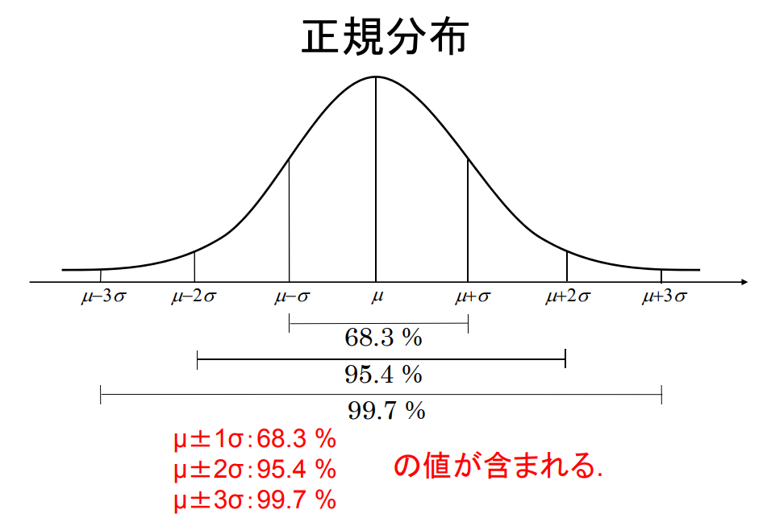

## $1.1$ Aタイプ標準不確かさ
#標準不確かさ #Aタイプ標準不確かさ

> [!note] Point!
> - Aタイプ標準不確かさは実験データのランダムな変動性を扱い、複数回の観測結果を評価するもの

> [!abstract] Aタイプ標準不確かさの求め方
> 1. 測定値の平均を求める
> $$ \mu_x = \frac{1}{n} \sum^{n}_{i=1} x_i $$
> 2. 測定値と測定値の平均から不偏分散を求める
> $$ \sigma^2_A = \frac{1}{n-1} \sum^{n}_{i=1} (x_i - \mu_x)^2 $$
> 3. 不偏分散の平方根をとる
> $$ \sigma_A = \sqrt{\sigma^2_A} $$

## $1.2$ Bタイプ標準不確かさ
#標準不確かさ #Bタイプ標準不確かさ

> [!note] Point!
> - Bタイプ標準不確かさは非統計的な手法に基づく評価で、専門知識や過去のデータを基にシステムの誤差や定常的な誤差を評価するもの

> [!abstract] Bタイプ標準不確かさの求め方
> - 仕様書に誤差「指示値の$\pm k \%$」と記載されていたとする
> 1. $b$から$a$までの範囲の一様分布の分散は$\frac{(b-a)^2}{12}$であるので、測定値を$x$とすると
> $$ \sigma^2_B = \frac{(b-a)^2}{12} = \frac{(2 \times (x \times k/100))^2}{12} $$
> 2. 不偏分散の平方根をとる
> $$ \sigma_B = \sqrt{\sigma^2_B} $$

## $1.3$ 合成不確かさ
#合成不確かさ

> [!abstract] 合成不確かさの求め方
> 1. AタイプとBタイプの不確かさの平方根をとる
> $$ \sigma_c = \sqrt{\sigma^2_A + \sigma^2_B} $$

## $1.4$ 拡張不確かさ
#拡張不確かさ

> [!note] Point!
> 
> - 95%信頼区間を得るには、測定値の平均から$\pm 2 \sigma_c$の範囲を求める

> [!abstract] 拡張不確かさの求め方
> 1. ガバレッジファクタを$n$とすると、拡張不確かさは
> $$ \sigma = n \times \sigma_c $$

## $1.5$ 結果
> [!abstract] 結果
> - 拡張不確かさを用いて表す
> $$ \bar{x} \pm \sigma $$

## $2.1$ 測定の方式による分類

### $2.1.1$ 零位法
#零位法

> [!abstract] 零位法
> - 測定量を別に用意した大きさを調整できる同種類の基準量と平衡させ、両者の差を検出する計器がゼロを示すようにして、その時の基準値の大きさから測定値を知る方法
> ![[零位法.png|600]]

### $2.1.2$ 偏位法
#偏位法

> [!abstract] 偏位法
> - 測定量を原因とし、その直接の結果として生じる指示から測定量を知る方法